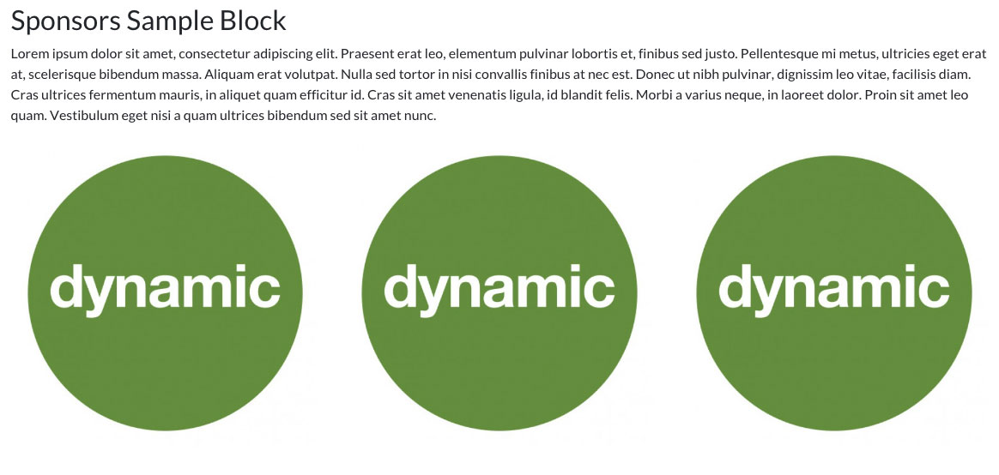
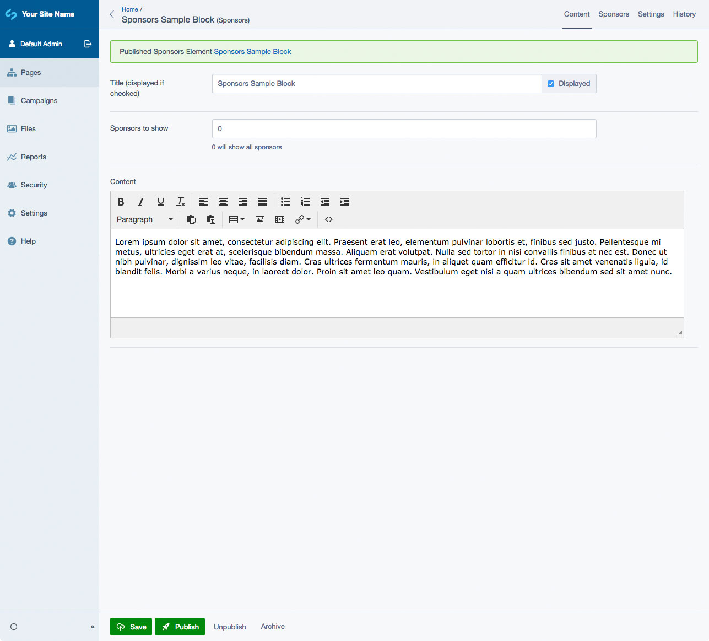
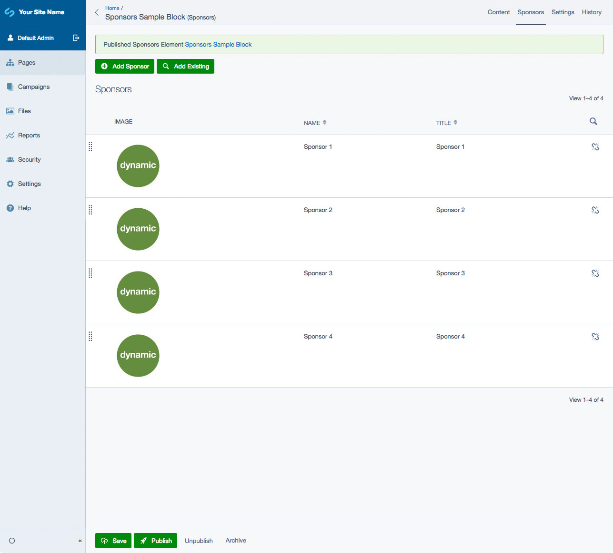

# SilverStripe Elemental Sponsors Block

Sponsors element for the [SilverStripe Elemental](https://github.com/dnadesign/silverstripe-elemental) module

## Requirements

* silverstripe/recipe-cms: ^4@dev
* dnadesign/silverstripe-elemental: ^4@dev

## Installation

`composer require dynamic/silverstripe-elemental-sponsors`

## Usage

A block that allows you to display multiple sponsors. Each sponsor can have a Title, Link, Image and Description. By default, the layout only shows the Image or Title with a link wrapped around it (if it's added).

An example enhancement would be to hookup a carousel to scroll through the sponsors instead of having multiple rows.

## Screen Shots

#### Front End sample of a Sponsors Element

#### CMS - Sponsors Element Main Tab

#### CMS - Sponsors Element - Sponsors List

#### CMS - Sponsors Element - Sponsor Add/Edit

## Getting more elements

See [Elemental modules by Dynamic](https://github.com/dynamic/silverstripe-elemental-blocks#getting-more-elements)

## Configuration

See [SilverStripe Elemental Configuration](https://github.com/dnadesign/silverstripe-elemental#configuration)
