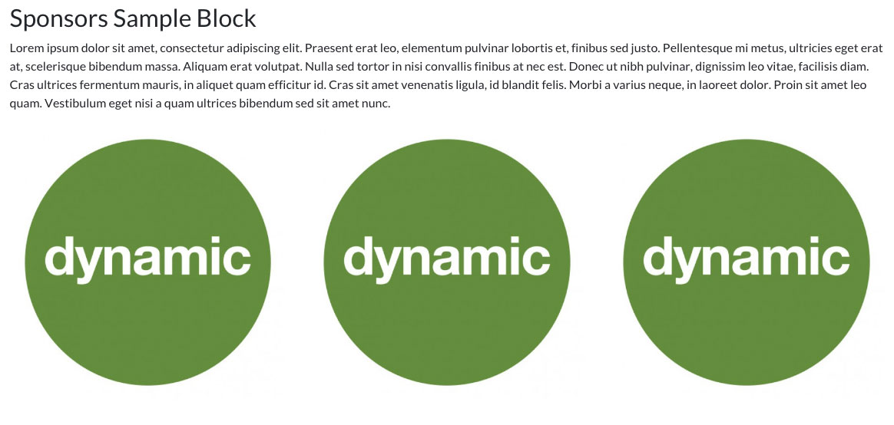
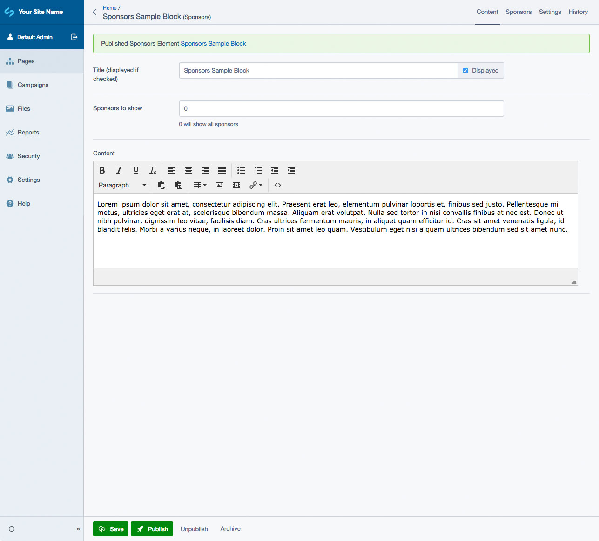
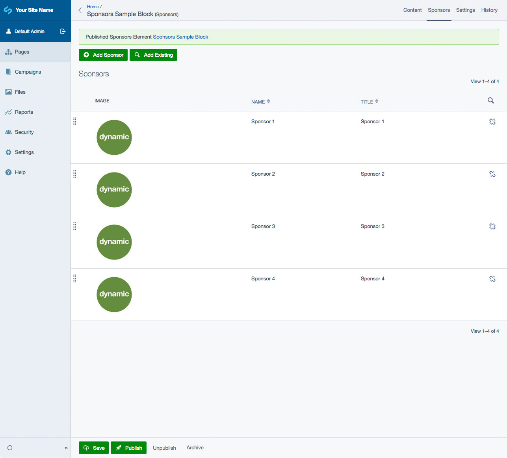
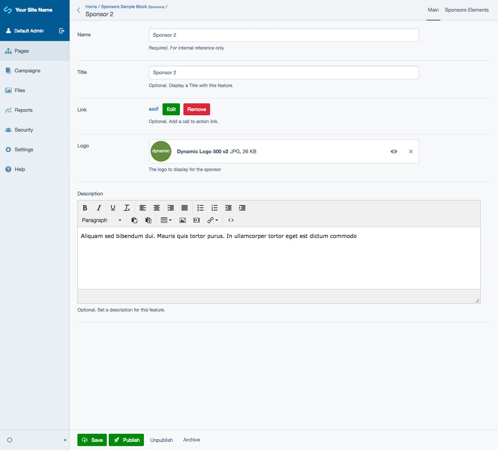

# SilverStripe Elemental Sponsors Block

Sponsors element for the [SilverStripe Elemental](https://github.com/dnadesign/silverstripe-elemental) module

## Requirements

* dnadesign/silverstripe-elemental ^5
* dynamic/silverstripe-elemental-baseobject ^5
* symbiote/silverstripe-gridfieldextensions ^4

## Installation

`composer require dynamic/silverstripe-elemental-sponsors`

## License

See [License](LICENSE.md)

## Upgrading from version 2

Elemental Sponsors drops `gorriecoe/silverstripe-linkfield` usage in favor of `silverstripe/linkfield`.

## Usage

A block that allows you to display multiple sponsors. Each sponsor can have a Title, Link, Image and Description. By default, the layout only shows the Image or Title with a link wrapped around it (if it's added).

An example enhancement would be to hookup a carousel to scroll through the sponsors instead of having multiple rows.

## Screen Shots

#### Front End sample of a Sponsors Element

#### CMS - Sponsors Element Main Tab

#### CMS - Sponsors Element - Sponsors List

#### CMS - Sponsors Element - Sponsor Add/Edit

## Getting more elements

See [Elemental modules by Dynamic](https://github.com/orgs/dynamic/repositories?q=elemental&type=all&language=&sort=)

## Configuration

See [SilverStripe Elemental Configuration](https://github.com/silverstripe/silverstripe-elemental#configuration)

## Maintainers

*  [Dynamic](https://www.dynamicagency.com) (<dev@dynamicagency.com>)

## Bugtracker
Bugs are tracked in the issues section of this repository. Before submitting an issue please read over
existing issues to ensure yours is unique.

If the issue does look like a new bug:

- Create a new issue
- Describe the steps required to reproduce your issue, and the expected outcome. Unit tests, screenshots
  and screencasts can help here.
- Describe your environment as detailed as possible: SilverStripe version, Browser, PHP version,
  Operating System, any installed SilverStripe modules.

Please report security issues to the module maintainers directly. Please don't file security issues in the bugtracker.

## Development and contribution
If you would like to make contributions to the module please ensure you raise a pull request and discuss with the module maintainers.
